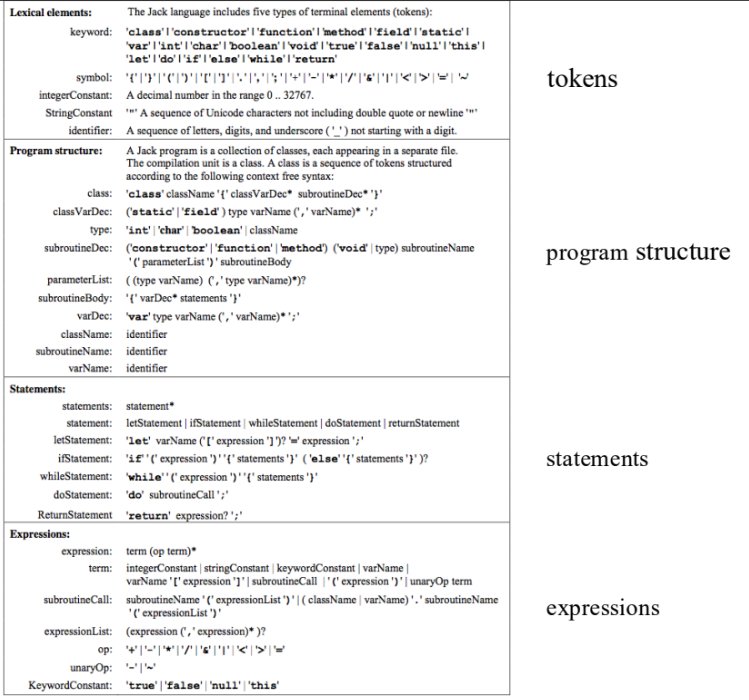
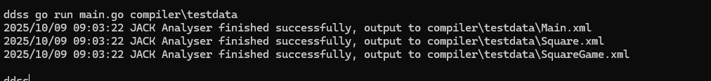

# Jack Compiler (Golang)

Simple (zero dependency), partially (only syntax and grammar implemented) working implementation of the Jack Compiler for the HACK VM language, as part of the course [Nand to Tetris](https://www.nand2tetris.org/), written in Golang.

## Grammar
 



## How to use

The `compiler/testdata` folder includes a few examples of valid Jack files and intermediante analysis (xml) files.

In order to run the translator, the following is required:

* Golang >= v1.25.0

Example for single Jack files:

```shell
go run main.go compiler/testdata/Main.jack
```

Example for multi Jack file folder:

```shell
go run main.go compiler/testdata/
```

Usage:

```plaintext
Usage of jackanalyser:
		JackAnalyzer myProg/FileName.jack
		JackAnalyzer myProg/
```

The program will generate an analysis XML file on the path `vm\testdata\FileName.xml` or `vm\testdata\jackFile.xml` in case of a folder.

## Screenshot



## Building

In order to submit projects to Coursera, I decided to create a fake Makefile and submit the Linux executable directly. In order to make that portable (I'm running Windows :confounded:), I created a Dockerfile to generate the proper binary (it's better than trying go multiplatform build).

Just run:

```shell
# building
docker build -t dd-jack-analyzer .
# running
docker run -d dd-jack-analyzer
# grab the container ID and run
docker cp $CONTAINER:/app/JackAnalyzer .
```

## Copyright

The Jack/HACK VM Language and it's specification, are part of the course Nand to Tetris ([https://www.nand2tetris.org/](https://www.nand2tetris.org/)) - copyright Noam Nisan and Shimon Schocken